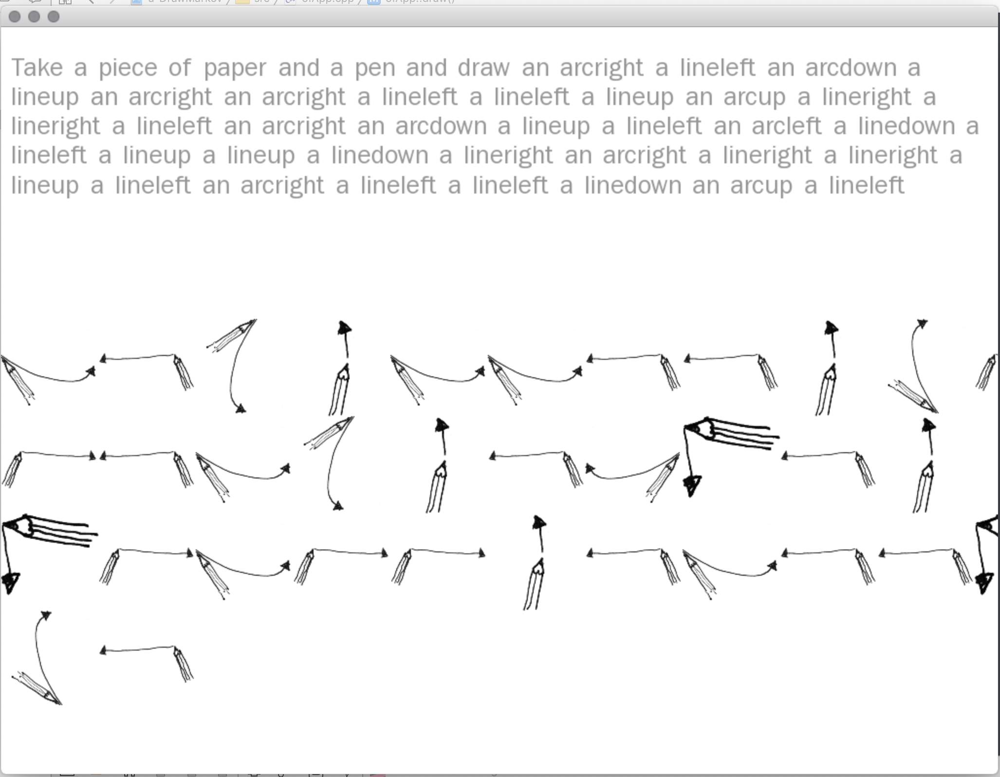
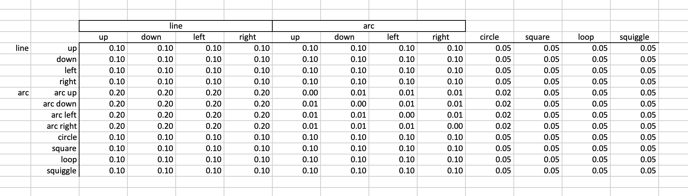

# 'Human-Machine-Human Drawing’ 
A collaborative markov chain based drawing instruction system 

'Human-Machine-Human Drawing’ is an interactive collaborative system built on abstracted rules for creating line drawings utilising intelligent state based probability modelling through Markov Chains. The system has been ’taught’ about differing types and styles of drawing based upon a series of original freehand-drawings made with pen and paper. With this interpreted ‘knowledge’ of the structure of a style of drawing the system generates instructions for more drawings ‘learned’ in this particular style. 

Using text, visual diagrams, and spoken instructions, the system directs human collaborator/participants to implement the drawing that is dictated by the system. Each human-rendered drawing is different, with each human hand interpreting the instructions of the system in differing ways, but all drawings from an individual session show similarity and consistency to the systems design.

The sytem generates a timed, variable number of instructions to a human drawerer using a succession on sinple icons and voice commands. 
The source code here includes a 12 x 12 matrix for drawing four orientations of lines and arcs plus squares, circles, loops and squiggles.

The examples here also include a spreadsheet with illustrative probability matrix underlying the markov chain model

code is C++ using the openFrameworks toolkit and uses Mac osX speech output announcing each new drawing step.

©2020 Dan Buzzo
github.com/danbz
http://buzzo.com

## dependencies

* ofxMarkovChain
* ofxTextSuite

## controls

* space: generate new drawing instruction from markov matrix
* g: show / hide gui
* f: toggle fullscreen
* r: reset
* a: autogenerate new drawing steps, at rate of guiSlider 'Speed' 

